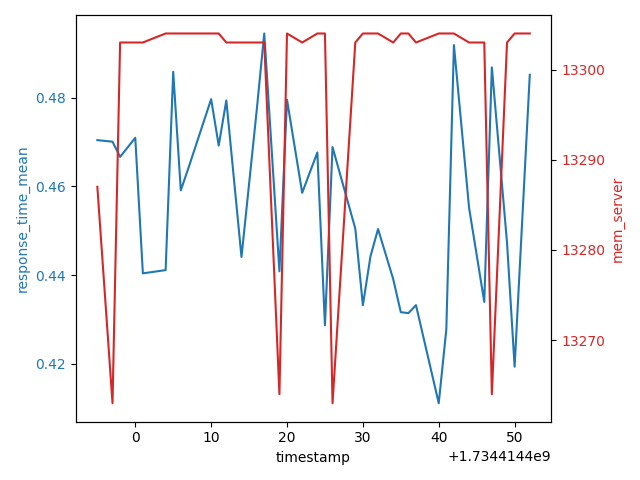
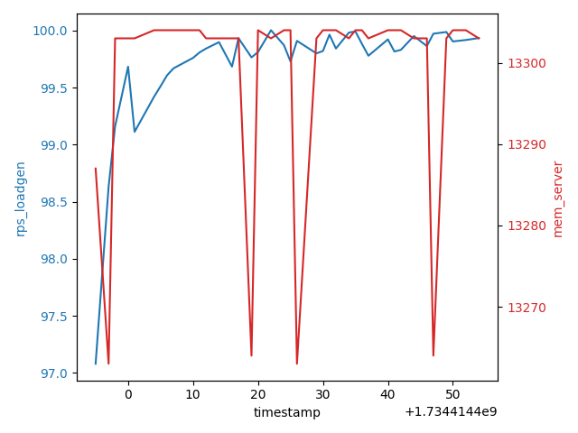

# Load testing tool for experiments 

This repository is a collection of tools and commands for configuring experiments and running load tests. Use this repository as a template to configure load testing for your own experiments. This doc will take you through the organization of this repository, usage, and the steps to configure and run load tests for your own experiments. 

This repository uses [K6](https://k6.io/) and [Nginx](https://www.nginx.com/) to run load tests. But you can configure this repository to use any other web server. The commands are written in a way that you can easily replace Nginx with any other web server. 

## Why K6? 

We performed a series of experiments with K6, Oha, Wrk, Wrk2, ApacheBench, and Locust. We found k6 to be the best tool in terms of ease of use, flexibility, and the metrics it provides. A detailed comparison of the tools is available in the report [here](https://github.com/rutu-sh/load-testing/blob/main/REPORT.md). 

## Getting started 

In this section we will go through the steps to configure and run the load tests with K6 and a Nginx web server. 

1. Clone this repository

```bash
git clone --recurse-submodules https://github.com/gwcloudlab/exp-load-test.git
```

2. Create a cloudlab experiment, or any other setup with two nodes connected by a link. Here we are using [CloudLab](https://www.cloudlab.us/) to create a simple experiment with two nodes using the CloudLab profile [ub-2-node](https://www.cloudlab.us/p/d5c0176c154f497f53637e59a6173e04569a6452). This creates a simple experiment with two Ubuntu 22.04 nodes connected by a link. If you are using any other setup, the commands in this repository can be easily adapter to your setup, provided you have configured both the load generator and the web server to use the same ssh key. 

3. Setup the cloudlab configurations. This step helps you configure the repository to use with cloudlab and your own setup. The tools in the `setup/cloudlab-tools` directory provide you with a range of commands to help you in your experiments. 

```bash
make cl-setup
``` 

This command will create a `.cloudlab` directory. This directory contains the configuration files used by the cloudlab tools. Configure the following parameters in the `.cloudlab/config` file.

- `SSH_KEY_PATH` : The absolute path to the ssh key used to connect to the nodes.
- `CLOUDLAB_USERNAME` : Ths username to use with your cloudlab account, or the username for your custom servers. 
- `NODE_0` : The IP address of the load generator node. This node will generate the load for the web server.
- `NODE_1` : The IP address of the web server node. This node will host the web server.

4. Setup the platform. Run the following command to setup the platform. This command will install the necessary tools on the nodes and configure them. 

```bash
make setup-platform
```

5. Configure the experiment. Add your experiment configurations to the `experiments.json` file. A sample configuration looks like this: 

```json
[
    {
        "name": "exp-1",
        "description": "This is the first experiment. With 100 worker connections.",
        "config": {
            "loadgen": {
                "runcfg": "configs/k6/default/script.js",
                "parameters": []
            },
            "server": {
                "WORKER_CONNECTIONS": 100
            }
        },
        "tags": [
            "variable worker connections"
        ]
    },
]
```

Let's break down the configuration: 

- `name`: The name of the experiment. This is a unique identifier for the experiment. The experiment will be addressed through this name throughout your experimentation phase. 

- `description`: A brief description of the experiment. 

- `config`: The configurations for the load generator and the web server. 

    - `loadgen`: The configurations for the load generator. 

        - `runcfg`: The path to the k6 script file. This file contains the k6 script that generates the load. 

        - `parameters`: The additional parameters to pass to the k6 run command. 

    - `server`: The configurations for the web server. 

        - `WORKER_CONNECTIONS`: The number of worker connections to configure for the web server. This is a Nginx-specific configuration, you can add your own configurations for the server of your choice. 

- `tags`: A list of tags to categorize the experiments.


6. Run the experiment. Run the following command to run the experiment. 

```bash
make run-exp EXP_NAME=exp-1
```

After this, you will have a directory created with the name `experiments/exp-1` in the root of this repository. This directory contains the following: 

- `config`: which contains a copy of configurations for the load generator and web server. These configs are copied with the experiment because the configurations might change between experiments and you might want to keep a record of the configurations used for each experiment.
    - `loadgen`: contains the configurations for the load generator, including the k6 script and any additional parameters passed to the k6 run command. 
    - `server`: contains the configurations for the web server. 
    - `experiment.json`: this file contains the json configuration of the experiment that was specified in the `experiments.json` file.
- `metrics`: contains the metrics collected during the experiment.
    - `loadgen`: this directory contains the metrics of the load generator.
        - `error.log`: this file contains the logs of the load generator
        - `exp_report.html`: this file contains an html report of the experiment. The report contains the metrics gathered by k6 and some visualizations. 
        - `out.txt`: this is the output of the k6 run command. 
        - `per_req_data.csv`: this file contains the metrics of each request made by the load generator.
        - `results.csv`: this csv contains the benchmarks of the load generator and metrics from the K6. 
    - `server`: this directory contains the metrics of the web server.
        - `results.csv`: this csv contains the benchmark of the web server throughout the duration of the experiment. 
    - `processed`: this directory contains the processed data and plots of the metrics. 
        - `data`: this directory contains the processed data of the metrics. It contains the following csv files:
            - `merged_results.csv`: This file contains the merged results of the load generator and the web server.
            - `per_req_agg.csv`: This file contains the aggregated metrics for each request made by the load generator, along with the benchmarking results of the web server. 
        - `plots`: this directory contains the plots of the metrics.
            - `response_time_vs_cpu`: this polt shows shows the variations in the response time as recorded in the load generator and the CPU usage of the web server, against timestamp. 
            - `response_time_vs_memory`: this plot shows the variations in the response time as recorded in the load generator and the memory usage of the web server, against timestamp.
            - `rps_vs_cpu`: this plot shows the variations in the requests per second as recorded in the load generator and the CPU usage of the web server, against timestamp.
            - `rps_vs_memory`: this plot shows the variations in the requests per second as recorded in the load generator and the memory usage of the web server, against timestamp.

You can use these metrics to analyze the performance of the web server throughout the duration of the experiment. 

The experiments repository is not included in the git version controlling because the experiments results can be large. This may also go beyond the git storage limits. If you want to store the results, you can use a cloud storage service like AWS S3, Google Cloud Storage, or any other storage service. 

A sample output of step 6 is provided in the directory [examples/experiments/exp-1](examples/experiments/exp-1) directory. 


## Organization of this repository

This repository is organized as follows: 

```shell
.
├── .cloudlab
├── configs
│   ├── k6
│   └── server
├── examples
│   ├── experiments
│   │   └── exp-1
│   │       ├── config
│   │       │   ├── loadgen
│   │       │   └── server
│   │       └── metrics
│   │           ├── loadgen
│   │           └── server
│   │           ├── processed
│   │           │   ├── data
│   │           │   └── plots
│   └── k6
│       ├── k6_resp
│       │   └── output
│       ├── open-model
│       └── testing-types
├── experiments
│   └── exp-1
│       ├── config
│       │   ├── loadgen
│       │   └── server
│       └── metrics
│           ├── loadgen
│           └── server
├── loadgen
├── scripts
├── server
└── setup
│   └── cloudlab-tools
├── experiments.json
├── install.sh
├── LICENSE
├── Makefile
├── README.md
└── requirements.txt
```

- `.cloudlab`: This directory is created when you run the `make cl-setup` command. This directory contains the cloudlab configurations. This directory is excluded from the git version controlling.
- `configs`: This directory contains the configurations for both the server and the load generator. 
    - `k6`: This directory contains the k6 script files. 
    - `server`: This directory contains the configurations for the web server.
- `examples`: This directory contains examples of k6 scripts and other useful resources. 
    - `experiments`: This directory contains the example output of the experiments. 
    - `k6`: This directory contains examples of k6 scripts.
- `experiments`: This directory contains the results of the experiments. This directory is excluded from the git version controlling. 
- `loadgen`: This directory contains the benchmarking scripts for the load generator. 
- `scripts`: This directory contains the shell scripts to perform the experiments.
- `server`: This directory contains the configuration and benchmarking scripts for the server.
- `setup`: This directory contains the setup scripts, including the cloudlab-tools submodule. 
- `experiments.json`: This flie contains all hte experiments you would wish to perform. You can add experiment metadata here and use the make targets to perform the experiments.
- `install.sh`: This script contains the installation scripts, useful for setting up the server. 
- `Makefile`: This file contains a collection of make targets useful for setting up and running the experiments. 
- `requirements.txt`: This file contains the python requirements useful for plotting the results. 

## Analyzing the results

This repository provides you with the necessary tools to perform your experiment with a single command. The results are also copied from the respective benchmarking nodes and the some simple graphs are plotted. An example of the outputs is provided in the [examples/experiments/exp-1](examples/experiments/exp-1) directory. Here is a small preview of the tables and plots generated:


### Raw metrics

The following files are created after copying the metrics from the load generator and the server:

- `metrics/loadgen/results.csv`: This csv contains the benchmarks of the load generator and metrics from the K6.
- `metrics/loadgen/per_req_data.csv`: This file contains the metrics of each request made by the load generator.
- `metrics/server/results.csv`: This csv contains the benchmark of the web server throughout the duration of the experiment.

Here is a sample of the data:

#### metrics/loadgen/results.csv

|Timestamp (s)|CPU (%)|MEM (KB)|Bandwidth (KB/s)|Bandwidth Utilization (%)|Open Sockets|VUS|RPS              |
|-------------|-------|--------|----------------|-------------------------|------------|---|-----------------|
|1734414394   |17.0   |50472   |137.47          |0.01                     |0           |0  |0                |
|1734414395   |24.8   |55104   |158.89          |0.01                     |95          |0  |97.08102802687466|
|1734414397   |15.0   |57848   |158.91          |0.01                     |95          |0  |98.6317855194196 |


#### metrics/loadgen/per_req_data.csv

|timestamp |url |method|status|response_time|body_size|
|----------|----|------|------|-------------|---------|
|1734414393|http://192.168.1.2|GET   |200   |1.334578     |612      |
|1734414393|http://192.168.1.2|GET   |200   |0.528286     |612      |
|1734414393|http://192.168.1.2|GET   |200   |0.379186     |612      |


#### metrics/server/results.csv

|TIMESTAMP |CPU |MEM  |
|----------|----|-----|
|1734414393|0   |12827|
|1734414395|8.7 |13287|
|1734414396|2   |13304|


### Aggregated metrics

The following files are created after copying the metrics from the load generator and the server: 
- `metrics/processed/data/merged_results.csv`: This file contains the merged results of the load generator and the web server. 
- `metrics/processed/data/per_req_agg.csv`: This file contains the aggregated metrics for each request made by the load generator, along with the benchmarking results of the web server.

Here is a sample of the data: 

#### metrics/processed/data/merged_results.csv

|timestamp |cpu_server         |mem_server         |cpu_loadgen|mem_loadgen|bandwidth_loadgen|bandwidth_utilization_loadgen|open_sockets_loadgen|vus_loadgen|rps_loadgen|
|----------|-------------------|-------------------|-----------|-----------|-----------------|-----------------------------|--------------------|-----------|-----------|
|1734414395|8.7                |13287              |24.8       |55104      |158.89           |0.01                         |95                  |0          |97.08102802687466|
|1734414397|3.0                |13263              |15.0       |57848      |158.91           |0.01                         |95                  |0          |98.6317855194196|
|1734414398|2.0                |13303              |27.0       |59904      |158.76           |0.01                         |95                  |0          |99.16193156281643|


#### metrics/processed/data/per_req_agg.csv

|timestamp |response_time_mean |response_time_std  |response_time_min|response_time_max|cpu_server|mem_server|cpu_loadgen|mem_loadgen|bandwidth_loadgen|bandwidth_utilization_loadgen|open_sockets_loadgen|vus_loadgen|rps_loadgen      |
|----------|-------------------|-------------------|-----------------|-----------------|----------|----------|-----------|-----------|-----------------|-----------------------------|--------------------|-----------|-----------------|
|1734414395|0.47041967999999995|0.06179901456438345|0.296018         |0.59             |8.7       |13287     |24.8       |55104      |158.89           |0.01                         |95                  |0          |97.08102802687466|
|1734414397|0.47007924         |0.13556359636412035|0.283925         |1.618512         |3.0       |13263     |15.0       |57848      |158.91           |0.01                         |95                  |0          |98.6317855194196 |
|1734414398|0.4666482          |0.06265758903159717|0.342546         |0.625163         |2.0       |13303     |27.0       |59904      |158.76           |0.01                         |95                  |0          |99.16193156281643|


### Plots

The following plots are generated after copying the metrics from the load generator and the server:

- `metrics/processed/plots/response_time_vs_cpu`: This polt shows shows the variations in the response time as recorded in the load generator and the CPU usage of the web server, against timestamp.
- `metrics/processed/plots/response_time_vs_memory`: This plot shows the variations in the response time as recorded in the load generator and the memory usage of the web server, against timestamp.
- `metrics/processed/plots/rps_vs_cpu`: This plot shows the variations in the requests per second as recorded in the load generator and the CPU usage of the web server, against timestamp.
- `metrics/processed/plots/rps_vs_memory`: This plot shows the variations in the requests per second as recorded in the load generator and the memory usage of the web server, against timestamp.

Here is a sample of the plots:


#### metrics/processed/plots/response_time_vs_cpu


#### metrics/processed/plots/response_time_vs_memory



#### metrics/processed/plots/rps_vs_cpu


#### metrics/processed/plots/rps_vs_memory



